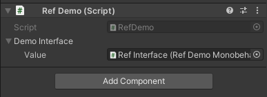

# Unity serialized reference
Serializes reference to interface implementation

```c#
    public interface IDemoInterface
    {
        void LogName();
    }
    
    
    public class RefDemo : MonoBehaviour
    {
        [SerializeField] private Ref<IDemoInterface> demoInterface;

        private void Awake()
        {
            //Usage
            demoInterface.Value.LogName();
        }
    }
```


